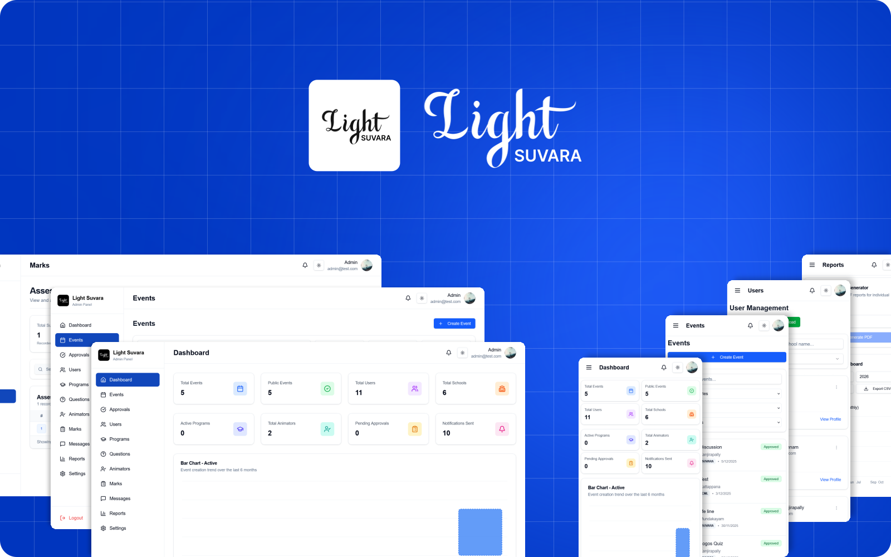

<div align="center">

<br><br>

  <picture>
    <source srcset="Public/assets/Readme/Header.svg">
    
  </picture>

<br>

<h1>Admin Dashboard UI Design</h1>
<br />
<sub>A modern, responsive dashboard for managing Schools, Users, and Events.</sub>

<br><br>
  <a href="#">
    
  </a>
  <a href="#">
    
  </a>
  <a href="#">
    
  </a>
  <a href="#">
    
  </a>

<br>

<a href="docs/FEATURES.md">🛠️ Features</a> ·
<a href="docs/QUICKSTART.md">⚡ Quick Start</a> ·
<a href="docs/DOCUMENTATION.md">📖 Documentation</a>

</div>

<br />

<div align="center">
  
  <!-- Replace above image with an actual screenshot of the dashboard if available -->
</div>

<br />

---

## ✨ Overview

**Admin Dashboard** is a centralized platform designed to streamline administration for educational institutions and event coordinators. It provides a robust set of tools for managing **Users (Admins, Schools, Animators)**, **Events**, and **Student Marks**.

With a focus on **User Experience**, the dashboard features a **premium dark mode**, **responsive layouts**, and **interactive data visualizations**.

> 📊 **Analytics** · 👥 **User Roles** · 📅 **Events** · 🎓 **Grading**

---

## 🚀 Comprehensive Features

**1. Role-Based Access & Management**
- **Secure Authentication:** Protected routes with distinct access levels.
- **User Portals:** Specialized interfaces for Admins, Schools (Technical Users), and Animators.
- **Granular Permissions:** Certain features (like Teacher Management, Programs, Observers) are restricted strictly to Administrators.

**2. Event Orchestration & Workflows**
- **Event Lifecycle:** Complete workflow for event creation, editing, and publishing.
- **Approval System:** Dedicated queues for event approvals, approved events, and rejected events.
- **Visibility Control:** Options to manage public and private events tailored to specific user groups.

**3. Academic & User Management**
- **Teacher Management:** Add and manage teacher profiles, assign them to exams, and generate duty assignments.
- **Animator Management:** Comprehensive tracking and management of animators across regions.
- **Observer Management:** Coordinate observers for examination processes and grading.
- **Technical Users (Parishes/Schools):** Manage institutional profiles, track activities, and view connected members.

**4. Programs & Registrations**
- **Program Creation:** Define and manage new programs or courses.
- **Registration Tracking:** Monitor and process program registrations seamlessly.
- **Program Analytics:** Dedicated dashboards for insights into program performance and enrollment statistics.

**5. Grading & Assessment**
- **Student Marks System:** Input, track, and manage student grades effectively.
- **Question Bank:** Centralized repository for managing exam questions and assessment materials.

**6. Communication & Notifications**
- **Internal Messaging:** Built-in messaging system to facilitate communication between roles.
- **Real-Time Notifications:** Alerts for approvals, approaching deadlines, and system updates.

**7. Data Visualization, Reporting & Logs**
- **Analytics Dashboard:** Radar and Bar charts providing actionable insights on system usage and performance.
- **Advanced Reports:** Generate detailed, high-quality PDF reports (e.g., Events PDFs).
- **System Audit Logs:** Comprehensive logging of system activities, ensuring transparency and security.

**8. Advanced Administration & Settings**
- **Theme & Content Settings:** Dynamically update the application's "Theme of the Year" and global content.
- **Bulk Operations:** CSV upload capabilities for efficient, mass user and data management.
- **System Settings:** Configure global preferences and fine-tune app behavior.

**9. Premium User Experience (UX/UI)**
- **Theme Awareness:** Stunning Dark/Light mode implementation with smooth circular reveal transitions.
- **Responsive Design:** A fully mobile-optimized layout providing a seamless experience across desktops, tablets, and smartphones.

---

## 🏗️ System Architecture & Complete Details

The web application is built on a modern, decoupled architecture designed for scalability and maintainability:

- **Frontend Interface:** A Single Page Application (SPA) built with React 18, utilizing Vite for fast bundling. It heavily employs Tailwind CSS for responsive styling and Radix UI primitives for accessible interactive components (modals, dropdowns, popovers, etc.). State management and form handling are powered by React Hook Form and Zod for robust schema validation.
- **Backend & Database:** Firebase acts as the backend-as-a-service (BaaS). Firestore (NoSQL) provides real-time document storage for core modules—Events, Users (Admins, Schools, Animators, Observers), Student Marks, Programs, and systemic Data Logs. Firebase Authentication handles secure login workflows.
- **Data Visualization & Analytics:** Recharts is integrated to compute and display programmatic insights (Radar & Bar charts) for the administration.
- **Document Generation:** Advanced PDF generation (e.g. for event summaries and exam reports) is supported both client-side via html2pdf.js/jspdf and server-side via Puppeteer.

---

## 📄 Report Generation

This project includes automated tools for generating high-quality PDF reports for events. Below is the complete Node.js code used for server-side generation using Puppeteer.

### `tools/generate-event-pdf.js`
```javascript
#!/usr/bin/env node
const fs = require('fs');
const path = require('path');
const puppeteer = require('puppeteer');

async function fileOrUrlToDataUrl(src) {
  if (!src) return '';
  try {
    if (/^https?:\/\//i.test(src)) {
      const res = await fetch(src);
      if (!res.ok) throw new Error('Failed to fetch image');
      const buf = Buffer.from(await res.arrayBuffer());
      const ct = res.headers.get('content-type') || 'image/jpeg';
      return `data:${ct};base64,${buf.toString('base64')}`;
    }

    // treat as local file
    const full = path.isAbsolute(src) ? src : path.join(process.cwd(), src);
    if (!fs.existsSync(full)) return '';
    const buf = fs.readFileSync(full);
    // guess content type from extension
    const ext = path.extname(full).toLowerCase();
    const mime = ext === '.png' ? 'image/png' : ext === '.webp' ? 'image/webp' : 'image/jpeg';
    return `data:${mime};base64,${buf.toString('base64')}`;
  } catch (e) {
    console.warn('Could not load image', src, e.message || e);
    return '';
  }
}

function defaultEvent() {
  return {
    title: 'Catholic Student Movement Inauguration',
    place: 'Kanjirapally',
    date: '2026-02-22',
    description: 'കാസറലിക്ക് സ്റ്റുഡൻസ് മുവ്മെന്റിന്റെ ഉദ്ഘാടനം ജോസ് പൂലിക്കല്‍ വിരാമ് നിരവഹിച്ചു',
    image: ''
  };
}

async function main() {
  const args = process.argv.slice(2);
  const eventPath = args[0] || path.join(__dirname, 'sample-event.json');
  const outPath = args[1] || path.join(process.cwd(), 'event-output.pdf');

  let event = defaultEvent();
  try {
    if (fs.existsSync(eventPath)) {
      const raw = fs.readFileSync(eventPath, 'utf8');
      event = Object.assign(event, JSON.parse(raw));
    }
  } catch (e) {
    console.warn('Failed to read event JSON, using defaults', e.message || e);
  }

  const imageData = await fileOrUrlToDataUrl(event.image || '');

  const html = `<!doctype html>
  <html>
    <head>
      <meta charset="utf-8" />
      <meta name="viewport" content="width=800" />
      <link href="https://fonts.googleapis.com/css2?family=Inter:wght@300;400;600;700&family=Noto+Sans+Malayalam:wght@400;700&display=swap" rel="stylesheet">
      <style>
        html,body{margin:0;padding:0;background:white}
        body{font-family: 'Noto Sans Malayalam', Inter, Arial, sans-serif; color:#000}
        .container{width:800px;padding:28px}
        .header{display:flex;align-items:center}
        .logo{width:72px;height:72px;object-fit:contain}
        .title-col{flex:1;text-align:center}
        .suvara{font-size:28px;font-weight:700;margin:0}
        .subline{font-size:11px;margin-top:6px}
        .malayalam{font-size:18px;font-weight:700;margin-top:8px}
        .divider{border-top:2px solid #000;margin:14px 0}
        .info-table td{padding:6px 0}
        .label{font-weight:700;width:130px}
        .section-title{font-size:16px;font-weight:700;margin:14px 0 6px;border-bottom:1px solid #000;padding-bottom:6px}
        .desc-box{border:1px solid #e0e0e0;padding:10px;min-height:28px}
        img.event{max-width:100%;border:1px solid #ddd}
      </style>
    </head>
    <body>
      <div class="container">
        <div class="header">
          
          <div class="title-col">
            <h1 class="suvara">SUVARA</h1>
            <div class="subline">CENTRE FOR CATECHESIS, EPARCHY OF KANJIRAPALLY</div>
            <div class="malayalam">വിശ്വാസജീവിത പരിശീലനം</div>
          </div>
        </div>
        <div class="divider"></div>
        <table class="info-table" style="width:100%;border-collapse:collapse">
          <tbody>
            <tr><td class="label">Venue:</td><td>${event.place || ''}</td></tr>
            <tr><td class="label">Date:</td><td>${event.date || ''}</td></tr>
          </tbody>
        </table>
        <div>
          <div class="section-title">Event Description</div>
          <div class="desc-box" style="margin-bottom:18px"><div style="white-space:pre-wrap;line-height:1.6">${event.description || ''}</div></div>
        </div>
        ${imageData ? \`<div style="text-align:center;margin-top:8px"></div>\` : ''}
      </div>
    </body>
  </html>`;

  console.log('Launching headless Chromium to render PDF...');
  const browser = await puppeteer.launch({ args: ['--no-sandbox', '--disable-setuid-sandbox'] });
  try {
    const page = await browser.newPage();
    await page.setViewport({ width: 800, height: 1200 });
    await page.setContent(html, { waitUntil: 'networkidle0' });
    // give fonts a short extra moment
    await page.waitForTimeout(300);
    const pdfOptions = { path: outPath, format: 'A4', printBackground: true, margin: { top: '12mm', right: '12mm', bottom: '12mm', left: '12mm' } };
    await page.pdf(pdfOptions);
    console.log('PDF written to', outPath);
  } finally {
    await browser.close();
  }
}

main().catch(err => {
  console.error(err);
  process.exit(1);
});
```

---

## 🛠️ Tech Stack

Built with cutting-edge web technologies for performance and scalability:

<div align="center">


</div>

<br>

---

## 📦 Installation

This project uses **pnpm** for package management.

### Run locally

```bash
git clone https://github.com/AbinVarghexe/Admindashboarduidesign.git
cd Admindashboarduidesign

# Install dependencies
pnpm install

# Start development server
pnpm run dev
```

See [Quick Start](docs/QUICKSTART.md) for detailed instructions.

---

## 👥 Contributors

Thanks to the team for making this project possible!

<div align="center">

<a href="https://github.com/AbinVarghexe/Admindashboarduidesign/graphs/contributors">
  
</a>

</div>

<br>

<div align="center">
  <sub>Made with <a href="https://contrib.rocks">contrib.rocks</a></sub>
</div>

---

## 📄 License

This project is licensed under the **MIT License** — see the [LICENSE](LICENSE) file for details.

---

<div align="center">
  
**Designed & Developed with ❤️**

<br>

⭐ Star this repo if you find it helpful!

</div>
