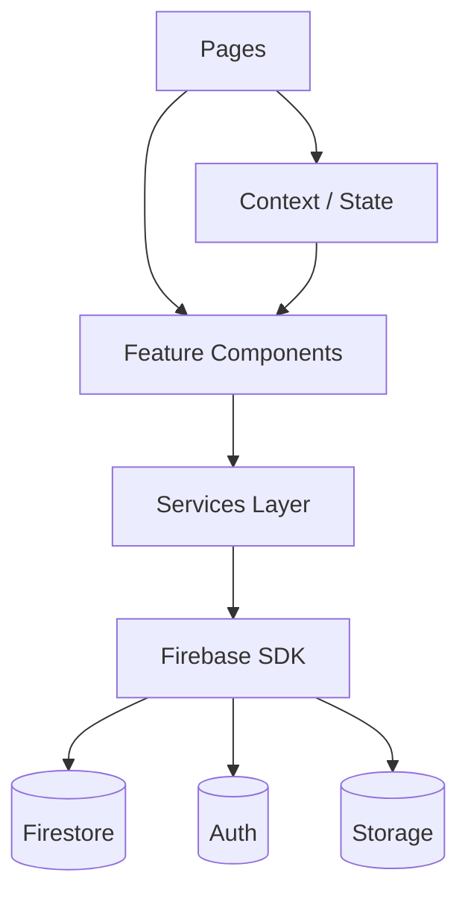

# Light Suvara — Admin Web Panel Documentation

**Version:** 2.0 &middot; **Last Updated:** February 2026

> A comprehensive React-based web administration panel for the Light Suvara Sunday School mobile application ecosystem, providing centralized management of events, users, programs, animators, teachers, observers, marks, and notifications.

---

## Table of Contents

1. [Project Overview](#1-project-overview)
2. [Tech Stack](#2-tech-stack)
3. [Getting Started](#3-getting-started)
4. [Project Structure](#4-project-structure)
5. [Architecture](#5-architecture)
6. [Firebase Integration](#6-firebase-integration)
7. [Authentication & Authorization](#7-authentication--authorization)
8. [Routing](#8-routing)
9. [Feature Modules](#9-feature-modules)
10. [Component Library](#10-component-library)
11. [Services Layer](#11-services-layer)
12. [PDF Generation](#12-pdf-generation)
13. [State Management](#13-state-management)
14. [Styling & Theming](#14-styling--theming)
15. [Firestore Security Rules](#15-firestore-security-rules)
16. [Deployment](#16-deployment)
17. [Environment Variables](#17-environment-variables)
18. [Troubleshooting](#18-troubleshooting)

---

## 1. Project Overview

**Light Suvara Admin Panel** is a full-featured web dashboard that administrators use to manage the Light Suvara Sunday School ecosystem. It serves as the control center for organizations under **CML** (Christian Mission League) and **SUVARA**.

### Key Capabilities

| Capability | Description |
|---|---|
| Event Management | Create, edit, publish, and delete events across all schools |
| User Administration | Manage users with roles: Admin, Parish, School, Animator |
| Program Configuration | Create educational programs with registration periods |
| Question Bank | Define assessment questions with marks allocation |
| Teacher Management | Manage teachers, assignments, and observer duties |
| Animator Management | Assign animators to schools (max 2 per animator) |
| Marks & Assessment | View marks submissions and generate PDF reports |
| Broadcast System | Send targeted or mass notifications |
| Reports & Analytics | Generate filterable PDF/CSV reports |

---

## 2. Tech Stack

| Layer | Technology |
|---|---|
| **Framework** | React 18 with TypeScript |
| **Bundler** | Vite 6 + `@vitejs/plugin-react-swc` |
| **Routing** | React Router v6 (browser router) |
| **Styling** | Tailwind CSS v4 + shadcn/ui components |
| **UI Primitives** | Radix UI (Accordion, Dialog, Select, Tabs, etc.) |
| **Forms** | React Hook Form + Zod validation |
| **Charts** | Recharts |
| **PDF** | jsPDF (with Malayalam font support) |
| **Icons** | Lucide React |
| **Toasts** | Sonner |
| **Theme** | `next-themes` (system/dark/light) |
| **Drag-and-Drop** | `@dnd-kit` |
| **Backend** | Firebase (Auth, Firestore, Storage, Cloud Functions) |

---

## 3. Getting Started

### Prerequisites

- **Node.js** ≥ 18
- **npm** or **pnpm**
- A Firebase project with Firestore, Auth, and Storage enabled

### Installation

```bash
# Clone the repository
git clone <repo-url>
cd light_suvara_web

# Install dependencies
npm install

# Create .env file (see Environment Variables section)
cp .env.example .env
```

### Development

```bash
npm run dev        # Start dev server on http://localhost:3000
```

### Production Build

```bash
npm run build      # Output to ./build directory
```

---

## 4. Project Structure

```
light_suvara_web/
├── Public/                      # Static assets (images, icons)
├── docs/                        # Project documentation
├── functions/                   # Firebase Cloud Functions
├── src/
│   ├── App.tsx                  # Root component (providers + router)
│   ├── main.tsx                 # Entry point
│   ├── index.css                # Global styles & Tailwind directives
│   │
│   ├── config/
│   │   └── firebase.ts          # Firebase initialization & exports
│   │
│   ├── context/
│   │   └── AuthContext.tsx       # Auth state provider (user, role, admin check)
│   │
│   ├── routes/
│   │   └── index.tsx            # Route definitions (createBrowserRouter)
│   │
│   ├── components/
│   │   ├── layout/              # Layout components (Header, Sidebar, etc.)
│   │   ├── ui/                  # 48 shadcn/ui primitives (Button, Card, etc.)
│   │   ├── common/              # Shared non-UI components
│   │   └── theme-provider.tsx   # Dark/light theme wrapper
│   │
│   ├── features/                # Feature-first architecture
│   │   ├── animators/           # Animator assignment services
│   │   ├── auth/                # Auth service (login, admin check)
│   │   ├── events/              # Event CRUD service
│   │   ├── marks/               # Marks data service
│   │   ├── notifications/       # Push notification service
│   │   ├── parishes/            # Parish data + seeder
│   │   ├── programs/            # Program CRUD service
│   │   ├── questions/           # Question bank service
│   │   ├── teachers/            # Teacher management (services, components, types)
│   │   ├── testing/             # Test cases, analysis, PDF report service
│   │   └── users/               # User CRUD service
│   │
│   ├── pages/                   # Route-level page components
│   │   ├── auth/                # Login, NotAuthorized
│   │   ├── dashboard/           # Dashboard page
│   │   ├── events/              # Events, EventDetail, EventForm
│   │   ├── users/               # Users list, UserDetail
│   │   ├── programs/            # Programs management
│   │   ├── questions/           # Question bank
│   │   ├── animators/           # Animator management
│   │   ├── marks/               # Marks viewer
│   │   ├── teachers/            # Teacher management page
│   │   ├── observers/           # Observer management
│   │   ├── notifications/       # Notification management
│   │   ├── messages/            # Messaging
│   │   ├── reports/             # Reports & PDF export
│   │   ├── settings/            # App settings
│   │   ├── testing/             # Testing dashboard
│   │   └── legal/               # Privacy Policy
│   │
│   ├── hooks/                   # Custom React hooks
│   ├── lib/                     # Utility functions (utils, upload, pdfFonts)
│   ├── styles/                  # Additional style files
│   └── types/                   # Shared TypeScript types
│
├── firebase.json                # Firebase project config
├── firestore.rules              # Firestore security rules
├── firestore.indexes.json       # Firestore index definitions
├── storage.rules                # Firebase Storage security rules
├── vite.config.ts               # Vite build configuration
└── package.json                 # Dependencies & scripts
```

---

## 5. Architecture

### Design Principles

- **Feature-First Architecture** — Business logic is organized by feature domain (events, teachers, users, etc.)
- **Single Responsibility** — One component per file, max 200 lines
- **Composition over Inheritance** — Functional components only
- **No Prop Drilling** — Context API for cross-feature state
- **Services Layer** — All Firebase/API calls isolated in `services/` files

### Data Flow



### Provider Hierarchy

```
ThemeProvider          — Dark/light/system theme
  └── AuthProvider     — User auth state + admin role check
      └── RouterProvider — React Router v6
          └── Layout   — Sidebar + Header + Content
```

---

## 6. Firebase Integration

### Configuration

Firebase is initialized in `src/config/firebase.ts` and exports four core services:

| Export | Service | Usage |
|---|---|---|
| `auth` | Firebase Auth | User authentication |
| `db` | Firestore | Document database |
| `storage` | Firebase Storage | File uploads (images, PDFs) |
| `functions` | Cloud Functions | Server-side logic |

### Firestore Collections

| Collection | Purpose | Key Fields |
|---|---|---|
| `users` | All user accounts | `uid`, `email`, `role`, `schoolName`, `forane` |
| `events` | School/admin events | `title`, `date`, `category`, `isPublic`, `creatorId` |
| `notifications` | Targeted notifications | `title`, `body`, `recipientId`, `isBroadcast` |
| `broadcasts` | Public announcements | `title`, `body`, `category` |
| `programs` | Educational programs | `name`, `startDate`, `endDate`, `isActive` |
| `program_registrations` | Student enrollments | `programId`, `studentName`, `status` |
| `questions` | Assessment questions | `text`, `maxMarks`, `order` |
| `animator_assignments` | Animator-school links | `animatorName`, `assignments[]` |
| `marks` | Assessment scores | `marks{}`, `unitId`, `locked` |
| `parishes` | Parish directory | `name`, `forane`, `id` |

---

## 7. Authentication & Authorization

### Auth Flow

1. User enters email/password on `/login`
2. Firebase Auth validates credentials
3. `AuthProvider` fetches the user document from `users` collection
4. Admin status is determined by checking `role === 'admin'`
5. Non-admin users are redirected to `/not-authorized`

### Auth Context

`src/context/AuthContext.tsx` exposes:

```typescript
interface AuthContextType {
  currentUser: User | null;     // Firebase Auth user
  userRole: 'admin' | 'school' | null;
  loading: boolean;
  isAdminUser: boolean;          // true if role === 'admin'
}
```

### Protected Routes

`src/components/layout/ProtectedRoute.tsx` wraps all authenticated routes, redirecting unauthenticated users to `/login` and non-admins to `/not-authorized`.

---

## 8. Routing

All routes are defined in `src/routes/index.tsx` using `createBrowserRouter`.

### Public Routes

| Path | Component | Description |
|---|---|---|
| `/login` | `Login` | Email/password login |
| `/not-authorized` | `NotAuthorized` | Access denied page |
| `/privacy-policy` | `PrivacyPolicy` | Legal page (public) |

### Protected Routes (Admin Only)

| Path | Component | Description |
|---|---|---|
| `/` | `Dashboard` | Admin dashboard with metrics |
| `/events` | `Events` | Event listing & management |
| `/events/approvals` | `Events` | Event approval queue |
| `/events/new` | `EventForm` | Create a new event |
| `/events/:id` | `EventDetail` | View event details |
| `/events/:id/edit` | `EventForm` | Edit an existing event |
| `/users` | `Users` | User management |
| `/users/:id` | `UserDetail` | User profile details |
| `/programs` | `Programs` | Program management |
| `/questions` | `Questions` | Question bank |
| `/animators` | `Animators` | Animator management |
| `/marks` | `Marks` | Marks viewer |
| `/messages` | `Messages` | Messaging center |
| `/notifications` | `Notifications` | Push notifications |
| `/reports` | `Reports` | Reports & exports |
| `/settings` | `Settings` | App settings |
| `/teachers` | `TeacherManagementPage` | Teacher records & assignments |
| `/observers` | `Observers` | Observer management |
| `/testing` | `Testing` | Testing dashboard |

---

## 9. Feature Modules

### 9.1 Events (`features/events/`)

- **Service:** `eventService.ts` — CRUD operations on the `events` collection
- **Pages:** `Events.tsx` (list), `EventDetail.tsx` (view), `EventForm.tsx` (create/edit)
- **Features:** Publish/unpublish toggle, category filters (CML/SUVARA), image upload, date filtering, bulk actions

### 9.2 Users (`features/users/`)

- **Service:** `userService.ts` — Fetch/manage user documents
- **Pages:** `Users.tsx` (list with role filters), `UserDetail.tsx` (profile)
- **Roles:** `admin`, `school`, `animator`, `parish`

### 9.3 Programs (`features/programs/`)

- **Service:** `programService.ts` — Program CRUD + registration management
- **Page:** `Programs.tsx` — List, create, activate/deactivate programs

### 9.4 Questions (`features/questions/`)

- **Service:** `questionService.ts` — Question bank CRUD with ordering
- **Page:** `Questions.tsx` — Drag-and-drop reordering, inline editing

### 9.5 Animators (`features/animators/`)

- **Service:** `animatorService.ts` — Animator account creation, school assignments (max 2 per animator)
- **Page:** `Animators.tsx` — Dashboard with assignment management

### 9.6 Teachers (`features/teachers/`)

The most feature-rich module:

| File | Purpose |
|---|---|
| `types.ts` | `Teacher` and `Parish` TypeScript interfaces + Zod schemas |
| `teacherService.ts` | Teacher CRUD on Firestore |
| `assignmentService.ts` | Observer/teacher assignment management |
| `pdfService.ts` | PDF generation for reports (Sunday School, Teacher, Animator, Observer) |
| `seedService.ts` | Data seeding utilities |
| `TeacherList.tsx` | Teacher list component |
| `CreateTeacherForm.tsx` | Form for adding teachers |
| `TeacherAssignment.tsx` | Assignment management UI |
| `AssignmentHistory.tsx` | History of past assignments |

### 9.7 Marks (`features/marks/`)

- **Service:** `marksService.ts` — Read marks submissions, filter by year/parish/school
- **Page:** `Marks.tsx` — Marks viewer with detail dialog, PDF download

### 9.8 Notifications (`features/notifications/`)

- **Service:** `notificationService.ts` — Send broadcasts, targeted notifications
- **Page:** `Notifications.tsx` — Notification composer and history

### 9.9 Parishes (`features/parishes/`)

| File | Purpose |
|---|---|
| `parishService.ts` | Fetch parishes from Firestore |
| `parishSeeder.ts` | Seed parish data for development |

### 9.10 Reports (`pages/reports/`)

- **Page:** `Reports.tsx` — Multi-tab report generator with filters
- **Tabs:** Events, Sunday School, Teachers, Programs, Animators, Observers
- **Export Formats:** PDF (via `pdfService.ts`), CSV
- **Charts:** Bar charts, pie charts, radial bar charts (via Recharts)

### 9.11 Testing (`features/testing/`)

- `testCases.ts` — Predefined test case data
- `testAnalysisService.ts` — Test result analysis
- `testReportPdfService.ts` — PDF report generation for test results
- **Page:** `Testing.tsx` — Testing dashboard

---

## 10. Component Library

### Layout Components (`components/layout/`)

| Component | Purpose |
|---|---|
| `Layout.tsx` | Main app shell (sidebar + header + content outlet) |
| `Header.tsx` | Top navigation bar with user menu |
| `Sidebar.tsx` | Side navigation with collapsible menu |
| `ProtectedRoute.tsx` | Auth guard wrapper |
| `LegalLayout.tsx` | Layout for public legal pages |
| `LegalSidebar.tsx` | Sidebar for legal section |

### UI Primitives (`components/ui/`)

48 shadcn/ui components built on Radix UI, including:

`Accordion`, `AlertDialog`, `Avatar`, `Badge`, `Button`, `Calendar`, `Card`, `Chart`, `Checkbox`, `Collapsible`, `Command`, `ContextMenu`, `Dialog`, `Drawer`, `DropdownMenu`, `Form`, `HoverCard`, `Input`, `InputOTP`, `Label`, `Menubar`, `NavigationMenu`, `Pagination`, `Popover`, `Progress`, `RadioGroup`, `ResizablePanel`, `ScrollArea`, `Select`, `Separator`, `Sheet`, `Sidebar`, `Skeleton`, `Slider`, `Sonner (Toast)`, `Switch`, `Table`, `Tabs`, `Textarea`, `Toggle`, `ToggleGroup`, `Tooltip`

---

## 11. Services Layer

All Firebase interactions are encapsulated in service files following this pattern:

```typescript
// features/<domain>/services/<domain>Service.ts
export const DomainService = {
  getAll: async () => { /* Firestore query */ },
  getById: async (id: string) => { /* doc(db, 'collection', id) */ },
  create: async (data: DomainType) => { /* addDoc / setDoc */ },
  update: async (id: string, data) => { /* updateDoc */ },
  delete: async (id: string) => { /* deleteDoc */ },
};
```

### Service Directory

| Service | File | Collection(s) |
|---|---|---|
| `authService` | `features/auth/services/authService.ts` | `users` |
| `eventService` | `features/events/services/eventService.ts` | `events` |
| `userService` | `features/users/services/userService.ts` | `users` |
| `programService` | `features/programs/services/programService.ts` | `programs`, `program_registrations` |
| `questionService` | `features/questions/services/questionService.ts` | `questions` |
| `animatorService` | `features/animators/services/animatorService.ts` | `animator_assignments`, `users` |
| `teacherService` | `features/teachers/services/teacherService.ts` | Custom teacher collection |
| `assignmentService` | `features/teachers/services/assignmentService.ts` | Assignments collection |
| `marksService` | `features/marks/services/marksService.ts` | `marks` |
| `notificationService` | `features/notifications/services/notificationService.ts` | `notifications` |
| `parishService` | `features/parishes/services/parishService.ts` | `parishes` |
| `pdfService` | `features/teachers/services/pdfService.ts` | — (PDF generation) |

---

## 12. PDF Generation

### Font Support

The app supports **Malayalam text rendering** in PDFs via a custom font registered in `src/lib/pdfFonts.ts`:

- Font: **NotoSansMalayalam** (`.ttf`)
- Helper: `createMalayalamPDF()` — creates a jsPDF instance with the font pre-registered

### Available Reports (via `PdfService`)

| Method | Description | Output |
|---|---|---|
| `generateFatherReport()` | Existing father/teacher duty report | PDF |
| `generateTeacherDutyReport()` | Teacher duty schedule | PDF |
| `generateSundaySchoolReport()` | Sunday School membership by forane/parish | PDF |
| `generateTeacherClassReport()` | Teachers grouped by class | PDF |
| `generateAnimatorReport()` | Animator directory with assignments | PDF |
| `generateObserverAssignmentReport()` | Observer duty assignments | PDF |
| `generateObserverDirectoryReport()` | Full observer directory | PDF |

### Event Reports

The Reports page (`Reports.tsx`) also generates:
- **Event PDF** — Individual event reports
- **Events CSV** — Bulk export of filtered events

---

## 13. State Management

| Scope | Mechanism | Example |
|---|---|---|
| **Local component state** | `useState` / `useReducer` | Form inputs, loading flags |
| **Cross-feature state** | React Context | `AuthContext` (auth state) |
| **Server state** | Direct Firestore queries in `useEffect` | Dashboard metrics |
| **Theme** | `next-themes` via `ThemeProvider` | Dark/light/system mode |

> No Redux or Zustand is currently used. Auth state is the only globally shared state via Context API.

---

## 14. Styling & Theming

### Tailwind CSS v4

- Configured via `@tailwindcss/vite` plugin
- Global styles in `src/index.css`
- Design system detailed in `src/DESIGN_GUIDELINES.md`

### Theme Support

- **Provider:** `ThemeProvider` from `next-themes`
- **Toggle:** `ModeToggle` component (system/light/dark)
- **Storage:** Persisted in `localStorage` under key `vite-ui-theme`

### Component Styling

- All components use **Tailwind utility classes**
- shadcn/ui components use `class-variance-authority` (CVA) for variants
- `tailwind-merge` and `clsx` are used for conditional class composition via the `cn()` utility in `src/lib/utils.ts`

---

## 15. Firestore Security Rules

Security rules are defined in `firestore.rules` with the following structure:

### Helper Functions

```
isAuthenticated()  — checks request.auth != null
isAdmin()          — checks authenticated + role === 'admin'
isOwner(userId)    — checks authenticated + auth.uid === userId
```

### Access Policies

| Collection | Read | Create | Update | Delete |
|---|---|---|---|---|
| `users` | Authenticated | Owner only | Admin or Owner | Admin only |
| `events` | Public (if approved) or Owner/Admin | Authenticated | Admin or Creator | Admin or Creator |
| `notifications` | Recipient, broadcast, or Admin | Admin only | Admin only | Admin only |
| `logs` | Authenticated | Authenticated | Admin only | Admin only |
| `parishes` | Authenticated | Authenticated* | Authenticated* | Authenticated* |
| `foranes` | Authenticated | Authenticated* | Authenticated* | Authenticated* |
| `schools` | Authenticated | Admin only | Admin only | Admin only |

*\*Temporarily open for data seeding*

---

## 16. Deployment

### Firebase Hosting

```bash
# Install Firebase CLI
npm install -g firebase-tools

# Login to Firebase
firebase login

# Build the project
npm run build

# Deploy
firebase deploy
```

### Build Configuration

| Setting | Value |
|---|---|
| Build output | `./build` |
| Dev server port | `3000` |
| Build target | `esnext` |
| Public directory | `Public` |

### Vercel (Alternative)

A `vercel.json` is present for Vercel deployment support.

---

## 17. Environment Variables

Create a `.env` file in the project root:

```env
VITE_FIREBASE_API_KEY=<your-api-key>
VITE_FIREBASE_AUTH_DOMAIN=<your-project>.firebaseapp.com
VITE_FIREBASE_PROJECT_ID=<your-project-id>
VITE_FIREBASE_STORAGE_BUCKET=<your-project>.firebasestorage.app
VITE_FIREBASE_MESSAGING_SENDER_ID=<sender-id>
VITE_FIREBASE_APP_ID=<app-id>
```

> All environment variables must be prefixed with `VITE_` to be accessible in client code via `import.meta.env`.

---

## 18. Troubleshooting

### Common Issues

| Issue | Solution |
|---|---|
| **Blank page after login** | Check that the logged-in user has `role: 'admin'` in the `users` collection |
| **Firebase permission denied** | Verify Firestore rules and that the user is authenticated |
| **PDF downloads not working** | Ensure `jspdf` is installed; check browser console for errors |
| **Malayalam text garbled in PDF** | Verify that `NotoSansMalayalam.ttf` is properly loaded via `pdfFonts.ts` |
| **Dev server won't start** | Delete `node_modules` and `package-lock.json`; run `npm install` again |
| **Build fails** | Check for TypeScript errors with `npx tsc --noEmit` |
| **Images not loading** | Static assets must be in the `Public/` directory (capital P) |

### Development Tips

- Use the **Testing** page (`/testing`) for running and analyzing test cases
- The **Reports** page supports multi-format export (PDF + CSV)
- Theme changes persist across sessions via localStorage
- The sidebar is collapsible for mobile-responsive layouts
